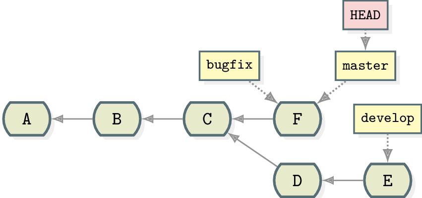
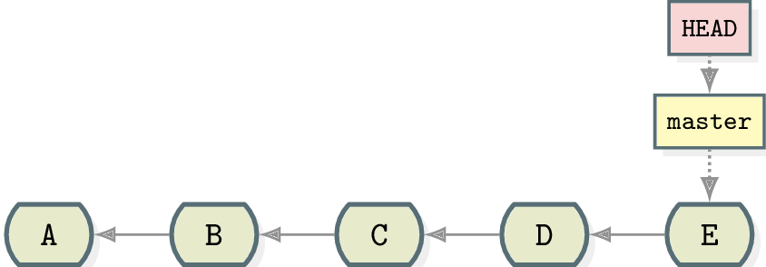
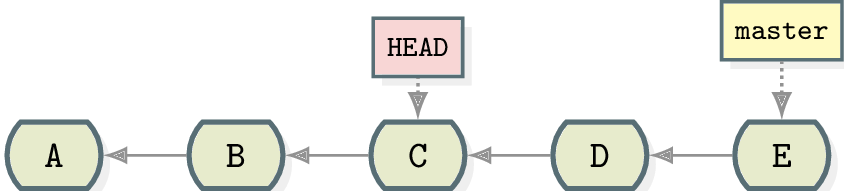
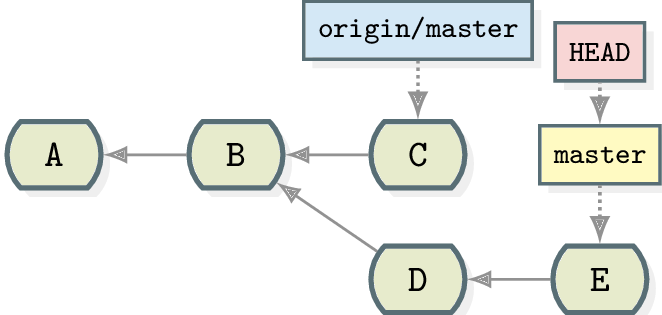
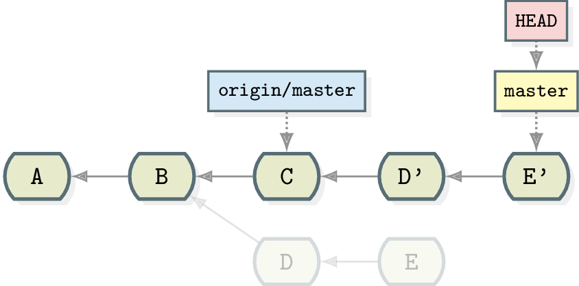

% Git Demystified
% Julien Cretel
% October 13, 2015

## Introduction

- Git is a powerful tool, but a stern taskmaster
- This is too short a talk for a formal Git tutorial.
- Don't expect to be proficient with Git by the end.
- Only a few pointers/tips for learning Git more efficiently

# The need for version control

## Sh*t happens (1/2)

## Sh*t happens (2/2)

# What is Version Control?

## What is a version-control system? (1/3)

In plain terms, a VCS is the combination of a photographic camera (for taking
snapshots)...

## What is a version-control system? (2/3)

...and a photo album for storing those snapshots...

## What is a version-control system? (3/3)

A VCS allows you to record the progress of your project,
revisit the past (if needed), and much more...

# A short history of Git

## The BitKeeper debacle

- Back in the early 00's, the Linux kernel uses a VCS called BitKeeper.
- Proprietary software, but with a free community edition (a controversial
  choice!)
- In April 2005, BitKeeper stops making its community edition available for
  free.
- The Linux project decides to drop BitKeeper...

## Linus to the rescue (1/3)

Linus Torvalds studies alternative VCS available at the time (CVS, SVN)...

## Linus to the rescue (2/3)

...and is not impressed.

> Subversion has been the most pointless project ever started. -- Linus
> Torvalds

## Git is born!

Linus rolls up his sleeves and writes an embryonic version of Git in just a
few weeks. Git is born!

- Distributed version-control system
- Free
- Open-source
- Cross-platform
- Faster than most other VCS
- Features safeguards against data corruption
- Primarily geared towards text files

## Explosion in popularity

- The most popular VCS today (according to the [Stack Overflow developer survey
2015](http://stackoverflow.com/research/developer-survey-2015#tech-sourcecontrol))
- Powers popular hosting platforms such as GitHub, Bitbucket, etc.

## Distributed vs. centralised

- No canonical/central repository (in theory)
    * Not so in practice, by convention
    * No single point of failure
    * Entire project history saved in many distributed backups
- No locking mechanism: developers can change the same file at the same time.
- Commits are local!
    * Allows for more incremental development steps
    * "I can code on an airplane!"
    * Merges are local.
    * Gone is the fear of committing and breaking the build!
- Branches are cheap!
    * Experiment (and commit) without polluting your stable code

## Problems with Git

- Steep learning curve
- A lot of technical jargon!
- Some Git terms (e.g. "branch") are unintuitive.
- Flat API (compared to Mercurial)

# Git terminology

## Working tree/directory

- Running

~~~~ {.bash}
git init
~~~~

 in your project directory creates a Git repository for it.

- The *working tree* (or *working directory*) corresponds to the contents of
  that directory, minus the `.git` folder.

## Commit (1/3)

- Also known as "revision", "snapshot"
- Reflects the state of your project as it was recorded at some point in
 the past.
- Relevant Git command:

    ~~~~ {.bash}
    git commit
    ~~~~

## Commit (2/3)

- Revisions, not "deltas" (although some compression is used)
- SHA-1 hash used as a unique commit identifier
    * Example: a7d826540887863781fafb8fd4dc545fa425a6ff
- Immutable
    * Once created, a commit is set in stone.
    * You cannot change an existing commit.
    * All you can do is create a new one that resembles the old one.

## Commit (3/3)

- Commits form a directed acyclic graph (DAG).
- A commits refers to its parent(s).
- A commit knows nothing about its children (if any).

## Staging area

- Also known as "index" (but prefer "staging area")
- An intermediate layer between the working tree and the next commit
- If *committing* is about "taking a snapshot", *staging* is about "composing
the shot".
- Relevant Git command:

    ~~~~ {.bash}
    git add
    ~~~~

## Branch (1/4)

- Arguably, the most misleading term of all Git jargon!
- A deceptive holdover from Git's predecessors
- A branch is *not*
    * a sequence of commits
    * a subgraph of the commit DAG
- A branch
    * is just a pointer/reference to a commit (its *tip*)
    * marks a point "where we left something off".
- Current branch
    * Marked by an asterisk in the output of `git branch`.
    * Moves along as you make new commits on it.

## Branch (2/4)

- If you think of your repo as a book that chronicles the progress in your
project, a branch is akin to one of those sticky bookmarks:

## Branch (3/4)

- A brand new repository has only one branch (called `master`).
- Branches are cheap! Create them when needed, then throw them away.
- Branches are the mechanism for integrating different versions of a
  codebase together.

## Branch (4/4)

- Don't think of commits as "belonging" to any particular branch.
- Instead, speak of commits as being *reachable* or *unreachable*
 from a particular branch.

## `HEAD` (1/2)

- The "you-are-here" mark on your repository's commit graph.

## `HEAD` (2/2)

- Typically points to a branch (called the *current branch*)

- Occasionally points *directly* to a commit (a situation known as *detached HEAD state*)

## Tag

- A type of reference (similar to a branch)
- Marks a point of historical interest (e.g. a release)
- Is not meant to be moved
- Come in two flavours: _lightweight_, and _annotated_
- Using the book metaphor, tags are akin to chapter headings.

## Reference

- A generic term for branches and tags.
- Commits that are not reachable from any reference become eligible for garbage
collection.

## Remote repository

- Any other repo that your repo "is aware of" and knows under a nickname
  (typically, `origin`)
- A remote repository can be on the same machine as the repo of interest!
- Relevant Git commands:

    ~~~~ {.bash}
    git remote
    git fetch
    git push
    ~~~~

# 10 tips for beginners

## Tip #1: Don't learn Git in an IDE (1/2)

> Quicker, easier, more seductive. -- Master Yoda

but...

## Tip #1: Don't learn Git in an IDE (2/2)

- Most IDEs have some Git integration, but...
- Learning Git in an IDE is a recipe for disaster!
- Stick to the command-line interface.
    * experimentation
    * understanding
    * reproducibility
- Switch to an IDE when you get more comfortable with Git.

## Tip #2: Commit often

- How often? It's up to you.
- Better be safe than sorry.
- You can always *rebase* (summarise) your work before sharing it.
- The distributed paradigm has freed you! Embrace it!

## Tip #3: Don't neglect commit messages

- Commit messages are important. Don't skip this step.
    * Explain/motivate your changes.
    * Adhere to your company's commit-message policy (if any).
- Write descriptive, to-the-point commit messages.
- Conventional format:
    * A single line of no more than 50 characters, optionally followed by...
    * a blank line and...
    * a more detailed description (<= 72 columns).
- Use the imperative mood (as if giving orders to the codebase).

Then, you can use

~~~~ {.bash}
git log --grep="foo"
~~~~

to search your commit messages (for "foo", here).

## Tip #4: Choose your branch names wisely

- Keep them short and sweet!
- Avoid any character that has a special meaning in shells.
If you don't, [chaos ensues](http://stackoverflow.com/q/32355540/2541573).

## Tip #5: Set up your `.gitignore` file, and track it

- Ideally, only source files should be put under version control.
- Generated/intermediate files should be ignored.
- Write a [`.gitignore`](https://git-scm.com/docs/gitignore) file to
 specify which files to ignore.
- Can be user-level or repository-specific
- Don't forget to also track your repo-specific `.gitignore`!

## Tip #6: Beware of `--force`/`-f` and `--hard`

- Don't use the `--force`/`-f` and `--hard` switches willy-nilly.
- Sometimes useful, but can cause irreparable damage.
- Example:

    ~~~~ {.bash}
    git reset --hard
    ~~~~

 wipes out all uncommitted changes... forever!

## Tip #6: Beware of `--force`/`-f` and `--hard` (cont'd)

> The `--force` is strong with this one... -- Darth Vader

- Make sure you know what you're doing before using those switches.

## Tip #7: Prefer `git fetch` over `git pull`

- `git pull` is not the dual of `git push`!
- `git pull` grabs the latest changes from a remote and attemps to
  automatically integrate (merge or rebase) your work with them.
- A source of much confusion! Avoid it.
- Instead, use `git fetch`, and then merge/rebase "manually"
- This allows you to inspect new changes on remote repo before integrating
your own work with them.

## Tip #8: Set up your line-endings settings appropriately

- Different operating systems use different line-ending sequences.
- If collaborators use different OS, line endings can be a problem.
- Set Git's line-ending configuration properly:
      * See [Dealing with line endings](https://help.github.com/articles/dealing-with-line-endings/)

## Tip #9: Tidy your work before sharing it

Use `git rebase` to make your work (*before* pushing!)

~~~~ {.bash}
git rebase origin/master
~~~~

## Tip #10: Do not rewrite shared history

- Rewriting public history is a cardinal sin.
- The surest way to piss your collaborators off!
- Use rebase judiciously.
- Use `git push -f` only in extraordinary circumstances.

# A few tips for more advanced Git users

## More advanced tips

1. Agree on a branching workflow and stick to it.
2. Use a commit template and [Git
hooks](https://git-scm.com/book/en/v2/Customizing-Git-Git-Hooks) to enforce your commit-message policy
3. Use [`git stash`](https://git-scm.com/docs/git-stash) to park clean your working tree before switching branches
4. Don't forget [`git reflog`](https://git-scm.com/docs/git-reflog) (your safety net).
5. In scripts, stick to
[*plumbing*](https://git-scm.com/book/en/v2/Git-Internals-Plumbing-and-Porcelain)
commands; avoid
[*porcelain*](https://git-scm.com/book/en/v2/Git-Internals-Plumbing-and-Porcelain) commands.
6. Activate [`rerere`](https://git-scm.com/blog/2010/03/08/rerere.html) ("reuse recorded resolution") to avoid having to resolve
the same conflicts over and over.
7. Use [`git
bisect`](https://git-scm.com/book/en/v2/Git-Tools-Debugging-with-Git#Binary-Search) to automatically locate when a regression was introduced.
8. Use [interactive
staging](https://git-scm.com/book/en/v2/Git-Tools-Interactive-Staging) for staging only some lines of file.

## Learning resources (1/2)

- [Pro Git book](https://git-scm.com/book/en/v2), by Scott Chacon & Ben Straub
- GitHub and Atlassian documentation
- [Git man pages](http://git-scm.com/docs)
- [Stack
  Overflow](http://stackoverflow.com/questions/popular/git?show=alltime&sort=votes)
- [Git Source Code Mirror](https://github.com/git/git)

## Learning resources (2/2)

Special mentions:

- [Git from the bottom up](https://jwiegley.github.io/git-from-the-bottom-up/), by John Wiegley
- [Ry's Git tutorial](http://rypress.com/tutorials/git/index), by Ryan Hodson
- [Git for computer
  scientists](http://eagain.net/articles/git-for-computer-scientists/), by
Tommi Virtanen

## Getting help

- Stack Overflow (`git` tag)
    * (An ASCII commit graph goes a long way!)

    ~~~~
                H---I---J topicB
               /
          E---F---G  topicA
         /
    A---B---C---D  master
    ~~~~

- IRC: #git channel on irc.freenode.net
- Git mailing list: git@vger.kernel.org

# Where to find me

## Where to find me

- StackOverflow:
  [2541573/jubobs](http://stackoverflow.com/users/2541573/jubobs)
- GitHub: [Jubobs](https://github.com/Jubobs)
- Twitter: [\@\_jubobs\_](https://twitter.com/_jubobs_)

I'm available for Git training. Give me a shout!
